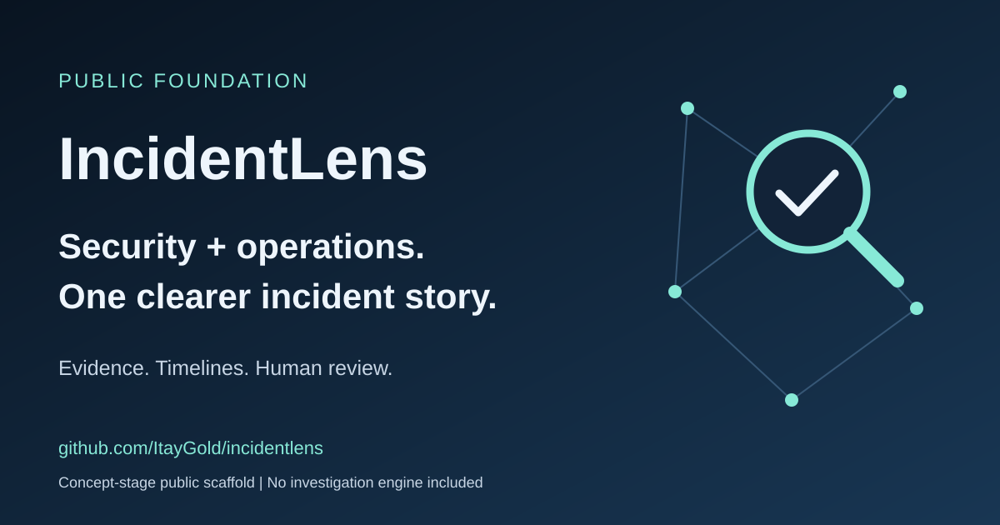

# IncidentLens

**From scattered signals to a clearer incident story.**

IncidentLens is an early-stage project exploring a shared investigation workspace
for security and operational incidents. Its vision is to help responders organize
evidence, understand timelines, distinguish facts from hypotheses, and communicate
what is known without losing sight of uncertainty.

## Why IncidentLens?

Incident response often spans alerts, logs, tickets, deployment records, and human
observations. Security and operations teams may be investigating the same event
from different perspectives. IncidentLens aims to make that context easier to
review together rather than treating a plausible explanation as a proven cause.

## What exists today

This repository contains project documentation, a static public landing page, and
a synthetic incident example. It is **not a working investigation engine**:
there are no collectors, ingestion services, live integrations, detection rules,
automated correlation, or AI analysis here. Product capabilities described as
goals are not shipped features.

The public scaffold can be explored without an account, API key, or customer data.
Open [`public/index.html`](public/index.html) in a browser to view the landing page.
No build or dependency installation is required.

## The vision

- Bring security and operational evidence into a common incident narrative.
- Keep source references, timestamps, and uncertainty visible.
- Support human review of competing hypotheses and next investigation steps.
- Produce concise handoffs that separate observations from interpretation.

These are design goals, not guarantees of coverage, accuracy, or response time.
IncidentLens is not a substitute for professional judgment or existing response
procedures.

## Explore

| Resource | Purpose |
| --- | --- |
| [Architecture](docs/architecture.md) | Public system boundaries and conceptual data flow |
| [Vision](docs/vision.md) | Intended users, outcomes, and non-goals |
| [Privacy and trust](docs/privacy-and-trust.md) | Current behavior and future design requirements |
| [Roadmap](docs/roadmap.md) | Proposed milestones without promised dates |
| [Engineering diary](docs/engineering-diary.md) | Decisions recorded as the project develops |
| [Synthetic incident](examples/synthetic-incident.json) | Fictional security/operations investigation handoff |
| [Contributing](CONTRIBUTING.md) | Safe ways to participate |
| [Security policy](SECURITY.md) | How to report concerns without exposing sensitive data |

## Public boundary

This repository intentionally excludes collectors, vendor mappings, internal
taxonomy, correlation and detection algorithms, prompts, scoring, and reasoning
implementation. Public examples illustrate an output format, not how analysis
is generated. Nothing here implies that those private components already exist.

## Project status and reuse

IncidentLens is in the concept/public-scaffold stage. Feedback on documentation,
investigation workflows, accessibility, and synthetic examples is welcome through
[GitHub issues](https://github.com/ItayGold/incidentlens/issues).

No software license has been selected. Public visibility does not grant permission
to reuse or redistribute this material; standard copyright restrictions apply
unless the owner grants permission.