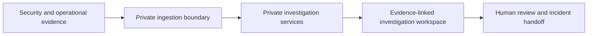

# Public architecture

This is a conceptual architecture, not an implemented system. The public
repository contains only documentation, static presentation, and fictional data.

The private boxes describe intended boundaries. They do not disclose algorithms,
source mappings, taxonomy, prompts, scoring, or reasoning internals.

## Responsibilities

| Boundary | Intended responsibility | Public implementation today |
| --- | --- | --- |
| Evidence sources | Provide authorized alerts, logs, changes, and observations | None |
| Ingestion | Enforce source authorization and preserve provenance | None |
| Investigation services | Organize evidence and candidate explanations | None |
| Workspace | Present evidence, timelines, uncertainty, and review state | Static landing page only |
| Handoff | Communicate observations and next steps for human review | Synthetic JSON example only |

## Design requirements

Evidence references should remain traceable to their original source. A timeline
must not erase timestamp uncertainty or imply that temporal proximity establishes
causation. Hypotheses should be explicitly labeled and revised through human
review.

Any future data-handling implementation must define authentication, authorization,
tenant boundaries, retention, deletion, auditing, and failure behavior before
accepting real incident evidence. None of these controls is implemented here.

## Repository layout

- `public/`: dependency-free static landing page.
- `assets/`: original project artwork.
- `examples/`: fictional output examples, not an ingestion API or stable schema.
- `docs/`: public concept and project decisions.

The example is manually authored. No executable analysis pipeline generates it.
